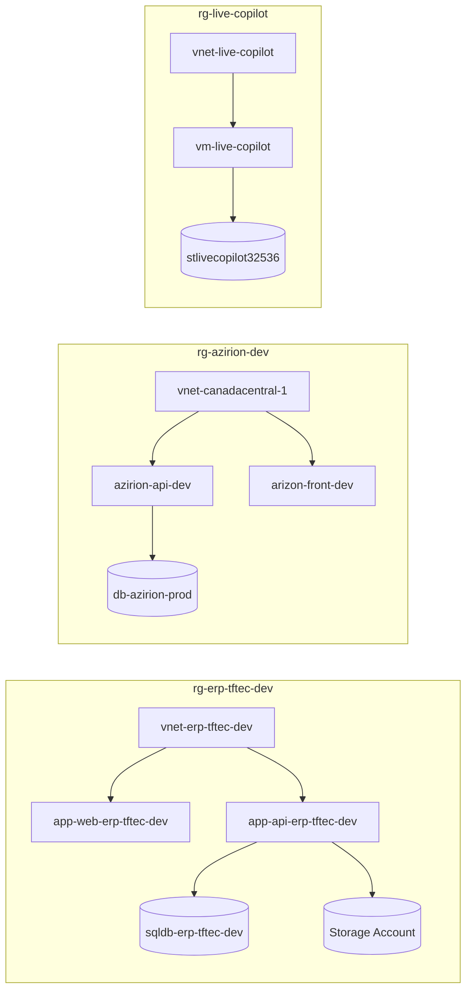

# Documento de Arquitetura do Ambiente Azure  
**Baseado no inventário fornecido**  
**Papel:** Arquiteto Azure Sênior  
**Idioma:** Português  
**Escopo:** análise técnica do inventário, organização por tipo de recurso, identificação de padrões arquiteturais, riscos, lacunas e boas práticas não seguidas.

---

## 1. Sumário Executivo

O ambiente Azure apresentado é composto por múltiplas soluções independentes, com forte presença de workloads de:

- **Aplicações Web e Functions**
- **Banco de dados SQL PaaS**
- **Integrações e mensageria**
- **Observabilidade**
- **Segurança e acesso privado a serviços**
- **Infraestrutura híbrida / Azure Stack HCI / Azure Arc**
- **Ambientes de desenvolvimento, homologação e produção**

Há sinais claros de adoção de padrões modernos, como:

- **Private Endpoints**
- **Private DNS Zones**
- **Managed Identities**
- **Application Insights / Log Analytics**
- **Azure Arc / Azure Stack HCI**
- **Serviços PaaS para aplicações e dados**

Por outro lado, o inventário também evidencia **fragilidades de governança**, **padronização inconsistente**, **possível excesso de recursos públicos expostos**, **nomenclatura heterogênea**, **mistura de ambientes sem segregação clara**, e **lacunas de segurança e operação** que precisam ser tratadas.

---

## 2. Visão Geral do Ambiente

### 2.1 Distribuição por domínios

O inventário sugere a existência dos seguintes domínios/sistemas:

1. **ERP / TFTEC**
   - `rg-erp-tftec-dev`
   - Recursos de App Service, SQL, Redis, Key Vault, Private Endpoints, App Insights, Service Bus, SignalR

2. **Azirion**
   - `rg-azirion-dev`
   - `rg-azirion-hml`
   - Recursos de Web Apps, Functions, SQL, Storage, Service Bus, App Service Plans, NSGs, VMs

3. **Agent SRE / YouTube / Observabilidade**
   - `rg-agentesre-youtube`
   - `rg-youtube-agent-sre`
   - `rg-sre-youtube`
   - `rg-agente-sre-dev`
   - Recursos de App Insights, alertas, action groups, web apps, managed identities, Logic App connections

4. **Ambiente híbrido / Azure Local / Arc / HCI**
   - `rg-azlocal`
   - Recursos de Azure Stack HCI, Arc bridge, custom location, máquinas híbridas, extensões, attestation, storage containers

5. **Ambiente de laboratório / arquitetura / testes**
   - `rg-disk-desafio`
   - `rg-lab-agent`
   - `rg-pos-arquitetura`
   - Recursos de storage, VMs, App Service Plan, Web App, Key Vault

6. **Recuperação de desastre / Site Recovery**
   - `site-recovery-vault-rg`
   - Recovery Services Vault, Automation Account, storage de cache

7. **DNS e rede compartilhada**
   - `rg-partiunuvem`
   - DNS Zones públicas

8. **Rede operacional**
   - `networkwatcherrg`
   - Network Watchers por região

---

## 3. Inventário Organizado por Tipo de Recurso

---

### 3.1 Monitoramento, Observabilidade e Alertas

#### Recursos identificados
- `microsoft.insights/components`
  - Application Insights:
    - `ai-erp-tftec-dev`
    - `sre-agent-103f5ce2-a22a-app-insights`
    - `agent-sre-c494576b-a384-app-insights`
    - `agent-sre-c134c2de-ad8f-app-insights`
    - `agent-dev-sre-a87ebece-93c5-app-insights`
    - `labtesteagentesre`
    - `ai-azirion-hml`
    - `agentsreyoutube`
- `microsoft.operationalinsights/workspaces`
  - Log Analytics:
    - `workspaceoosh3c64toi52`
    - `log-erp-tftec-dev`
    - `DefaultWorkspace-b9ce8dd6-e2f1-4f90-84a2-c4915fc609ec-CCAN`
    - `workspacehnsoxqz7xygzy`
    - `workspaceykrvpc6y474pm`
    - `log-azirion-hml`
    - `workspace5knrei4mhggeq`
- `microsoft.alertsmanagement/smartdetectoralertrules`
  - `Failure Anomalies - agentsreyoutube`
  - `Failure Anomalies - agent-sre-c494576b-a384-app-insights`
  - `Failure Anomalies - sre-agent-103f5ce2-a22a-app-insights`
- `microsoft.insights/actiongroups`
  - `Application Insights Smart Detection`
  - `Alert-WebApp`
- `microsoft.insights/activitylogalerts`
  - `Stop-Webapp`
- `microsoft.insights/metricalerts`
  - `Error-Http5xx`

#### Análise
Há uma base razoável de observabilidade, com uso de Application Insights e Log Analytics. Entretanto, o inventário mostra **múltiplos workspaces e múltiplos App Insights por solução**, o que pode indicar fragmentação operacional.

#### Riscos
- Fragmentação de logs e métricas entre vários workspaces.
- Dificuldade de correlação entre aplicações e infraestrutura.
- Possível duplicidade de alertas.
- Falta de padronização na estratégia de observabilidade.

#### Boas práticas não evidenciadas
- Workspace centralizado por domínio/ambiente.
- Padronização de retenção e diagnóstico.
- Correlação entre App Insights, Log Analytics e alertas.
- Uso explícito de dashboards, workbooks e alert rules como código.

---

### 3.2 Computação: Máquinas Virtuais, Discos, NICs, IPs, Extensões

#### Recursos identificados
- `microsoft.compute/virtualmachines`
  - `vm-youtube-001`
  - `vm-db-azirion`
  - `mcp-desk`
  - `mcp-azure`
  - `vm-live-copilot`
- `microsoft.compute/disks`
  - `DISK-VM-SQL`
  - `vm-live-copilot_OsDisk_...`
  - `DISK-VM-PORTAL`
  - `mcp-desk_OsDisk_...`
  - `vm-db-azirion_OsDisk_...`
  - `DISK-VM-HELP`
  - `vm-youtube-001_disk1_...`
  - `DISK-VM-DC`
  - `mcp-azure_OsDisk_...`
- `microsoft.network/networkinterfaces`
  - múltiplas NICs associadas às VMs e Private Endpoints
- `microsoft.network/publicipaddresses`
  - IPs públicos para VMs
- `microsoft.compute/virtualmachines/extensions`
  - `MDE.Windows` em várias VMs
- `microsoft.devtestlab/schedules`
  - `shutdown-computevm-vm-db-azirion`

#### Análise
O ambiente possui VMs em diferentes regiões, com discos gerenciados e extensões de segurança. Há também agendamento de desligamento, sugerindo uso de laboratório/dev/test.

#### Riscos
- Exposição pública de VMs via IP público.
- Possível ausência de hardening e baseline uniforme.
- Dependência de infraestrutura IaaS onde PaaS poderia reduzir operação.
- Uso de discos e NICs com nomes pouco padronizados, dificultando governança.
- Sem evidência de backup, ASR ou patch management para todas as VMs.

#### Boas práticas não evidenciadas
- Uso de Azure Bastion em vez de IP público para administração.
- Just-in-time access.
- Azure Policy para bloquear IP público em VMs não autorizadas.
- Backup e patching padronizados.
- Availability Set / Availability Zone quando aplicável.

---

### 3.3 Rede

#### Recursos identificados
- `microsoft.network/virtualnetworks`
  - `vnet-youtube-001`
  - `vnet-live-copilot`
  - `vnet-canadacentral-1`
  - `vnet-erp-tftec-dev`
  - `mcp-desk-vnet`
- `microsoft.network/networksecuritygroups`
  - vários NSGs por workload
- `microsoft.network/privateendpoints`
  - `pe-live-storage-file`
  - `pe-redis-erp-tftec-dev`
  - `pe-live-storage-blob`
  - `pe-kv-erp-tftec-dev`
  - `pe-sql-erp-tftec-dev`
- `microsoft.network/privatednszones`
  - `privatelink.file.core.windows.net`
  - `privatelink.vaultcore.azure.net`
  - `privatelink.redis.cache.windows.net`
  - `privatelink.database.windows.net`
  - `privatelink.blob.core.windows.net`
- `microsoft.network/privatednszones/virtualnetworklinks`
  - links correspondentes
- `microsoft.network/networkwatchers`
  - por região

#### Análise
Há adoção consistente de **Private Link** para serviços críticos no ambiente ERP e Live Copilot. Isso é positivo e indica preocupação com isolamento de rede.

#### Riscos
- Não há evidência de hub-and-spoke, firewall central, UDRs ou segmentação entre ambientes.
- NSGs existem, mas não é possível inferir se estão corretamente aplicados.
- Network Watcher existe por região, mas não há evidência de uso de flow logs, connection monitor ou NSG flow logs.
- VNet peering não aparece no inventário, o que pode indicar isolamento excessivo ou ausência de conectividade entre domínios.

#### Boas práticas não evidenciadas
- Arquitetura hub-and-spoke.
- Azure Firewall ou NVA central.
- DDoS Protection Standard para workloads expostos.
- NSG Flow Logs e Traffic Analytics.
- Separação de sub-redes por camada.

---

### 3.4 Armazenamento

#### Recursos identificados
- `microsoft.storage/storageaccounts`
  - `stlivecopilot32536`
  - `stotfteccopaazure`
  - `clsazlocal001sa`
  - `stodiskdesafio`
  - `stazirionhml`
  - `stoteftecaz104`
  - `rgaziriondevb7db`
  - `xvdtcksiterecovasrcache`
  - `stoposgraduacaotftec`
  - `clsazlocal007d5689fb38c9`
- `microsoft.azurestackhci/storagecontainers`
  - `UserStorage1...`
  - `UserStorage2...`

#### Análise
Há storage accounts distribuídas por vários ambientes, incluindo uso para cache de Site Recovery e possivelmente para dados de aplicação.

#### Riscos
- Não há evidência de configuração de replicação, versionamento, soft delete, immutability ou private endpoint em todos os storage accounts.
- Possível exposição pública se firewall/rede não estiverem restritos.
- Nomenclatura pouco padronizada em alguns casos.

#### Boas práticas não evidenciadas
- Private Endpoint para Storage.
- Desabilitar acesso público quando aplicável.
- Defender for Storage.
- Lifecycle management e políticas de retenção.
- Criptografia com CMK quando necessário.

---

### 3.5 Banco de Dados e Dados

#### Recursos identificados
- `microsoft.sql/servers`
  - `sql-azirion-hml`
  - `srv-sql-azirion-prod`
  - `tftecsaleshubsql2602151920`
  - `sql-erp-tftec-cc-dev`
  - `sqlsrv-tftec-crm`
- `microsoft.sql/servers/databases`
  - `sqldb-erp-tftec-dev`
  - `tftec-saleshub`
  - `sqldb-tftec-sales-crm`
  - `sqldb-azirion-hml`
  - `db-azirion-prod`
  - `master` em vários servidores
- `microsoft.cache/redis`
  - `redis-erp-tftec-dev`
- `microsoft.servicebus/namespaces`
  - `tftecsaleshub-sb-2602151920`
  - `sb-azirion-dev`
  - `sb-azirion-hml`
- `microsoft.signalrservice/signalr`
  - `sigr-erp-tftec-dev`
- `microsoft.keyvault/vaults`
  - `clsazlocal001-hcikv`
  - `kv-tftec-sales`
  - `keyvault-inter`
  - `kv-erp-tftec-dev`
  - `kv-azirion-hml`

#### Análise
O ambiente adota bem serviços PaaS para dados e integração. Há uso de SQL, Redis, Service Bus, SignalR e Key Vault, o que é um bom sinal de modernização.

#### Riscos
- Não há evidência de HA/DR para SQL, Redis e Service Bus.
- Não há evidência de geo-replicação, failover groups ou backups testados.
- Possível uso de SQL Server com configuração padrão.
- Key Vaults existem, mas não há evidência de RBAC, purge protection, soft delete e private endpoint em todos.
- Redis e SQL com private endpoint apenas em parte do ambiente.

#### Boas práticas não evidenciadas
- SQL Managed Instance ou elastic pools quando aplicável.
- Failover groups para SQL.
- Private Endpoint e firewall restritivo para todos os dados.
- Managed Identity consumindo segredos do Key Vault.
- Segregação por ambiente e por domínio.

---

### 3.6 Aplicações Web, Functions e App Service Plans

#### Recursos identificados
- `microsoft.web/serverfarms`
  - `asp-func-azirion-hml`
  - `tftecsaleshub-plan`
  - `asp-erp-tftec-dev`
  - `ASP-rglabagent-89e3`
  - `asp-azirion-hml`
  - `ASP-rgaziriondev-91f6`
  - `app-plan-arq`
- `microsoft.web/sites`
  - `arizon-front-dev`
  - `tftecsaleshub-worker-2602151920`
  - `azirion-api-dev`
  - `app-api-erp-tftec-dev`
  - `app-web-erp-tftec-dev`
  - `tftecsaleshub-web-2602151920`
  - `app-azirion-api-hml`
  - `labtesteagentesre`
  - `tftecsaleshub-api-2602151920`
  - `agentsreyoutube`
  - `func-azirion-hml`
  - `funcazirionscandev`
  - `app-azirion-web-hml`
- `microsoft.web/connections`
  - `agent-dev-sre-teams`
  - `agent-sre-teams`

#### Análise
Há forte uso de App Service e Functions, o que é positivo para reduzir operação de infraestrutura. O ambiente parece dividido por domínio e ambiente, mas com nomenclatura inconsistente.

#### Riscos
- Possível mistura de web app e function app no mesmo plano sem análise de consumo.
- Não há evidência de deployment slots, autoscale, health checks, backup de app, managed identity, VNet integration ou private endpoint para apps.
- Conexões com Teams indicam integração com serviços externos, exigindo governança de segredos e consentimento.

#### Boas práticas não evidenciadas
- Deployment slots para blue/green.
- Managed Identity para acesso a recursos.
- App Service Environment ou Private Endpoint quando necessário.
- Separação de planos por criticidade e carga.
- CI/CD com IaC e versionamento.

---

### 3.7 Identidade e Acesso

#### Recursos identificados
- `microsoft.managedidentity/userassignedidentities`
  - `agent-sre-oosh3c64toi52`
  - `agent-sre-ykrvpc6y474pm`
  - `agent-dev-sre-5knrei4mhggeq`
  - `sre-agent-hnsoxqz7xygzy`

#### Análise
Há uso de Managed Identities, o que é uma boa prática importante para reduzir segredos em código e configurações.

#### Riscos
- Não há evidência de RBAC padronizado.
- Não há evidência de PIM, MFA, Conditional Access ou separação de funções.
- Não há evidência de identidade gerenciada vinculada a todos os workloads críticos.

#### Boas práticas não evidenciadas
- RBAC mínimo necessário.
- PIM para funções privilegiadas.
- Managed Identity em todas as aplicações que acessam Key Vault, Storage, SQL, Service Bus.
- Access reviews periódicos.

---

### 3.8 Híbrido, Azure Stack HCI e Azure Arc

#### Recursos identificados
- `microsoft.azurestackhci/clusters`
  - `clsazlocal001`
- `microsoft.azurestackhci/storagecontainers`
- `microsoft.extendedlocation/customlocations`
  - `clsazlocal001-mocarb-CL`
- `microsoft.hybridcompute/machines`
  - `AZLOCAL-NODE02`
  - `AZLOCAL-NODE01`
- `microsoft.hybridcompute/machines/extensions`
  - `AzureEdgeRemoteSupport`
  - `AzureEdgeLifecycleManager`
  - `AzureEdgeTelemetryAndDiagnostics`
  - `MDE.Windows`
  - `AzureEdgeDeviceManagement`
- `microsoft.resourceconnector/appliances`
  - `clsazlocal001-arcbridge`
- `microsoft.attestation/attestationproviders`
  - `clsazl8ef2a611c9864f72`

#### Análise
Este é um bloco arquitetural relevante: há uma implementação de **Azure Local / Azure Stack HCI com Arc**, incluindo custom location, bridge e extensões de gerenciamento.

#### Riscos
- Complexidade operacional elevada.
- Dependência de conectividade e sincronização com Azure.
- Necessidade de governança forte sobre extensões e atualizações.
- Não há evidência de monitoramento centralizado e baseline de segurança para o cluster.

#### Boas práticas não evidenciadas
- Política de atualização e manutenção do cluster.
- Monitoramento de integridade e capacidade.
- Segmentação de acesso administrativo.
- Inventário e controle de extensões Arc.

---

### 3.9 Recuperação de Desastre e Continuidade

#### Recursos identificados
- `microsoft.recoveryservices/vaults`
  - `Site-recovery-vault-northeurope`
- `microsoft.automation/automationaccounts`
  - `site-reco-19s-asr-automationaccount`
- Storage account de cache
  - `xvdtcksiterecovasrcache`

#### Análise
Há indícios de uso de Azure Site Recovery, o que é positivo para continuidade de negócios.

#### Riscos
- Não há evidência de testes de failover/failback.
- Não há evidência de RPO/RTO definidos por aplicação.
- Não há evidência de proteção abrangente para todos os workloads críticos.

#### Boas práticas não evidenciadas
- Plano de DR documentado por sistema.
- Testes periódicos de recuperação.
- Runbooks automatizados.
- Inventário de dependências para failover.

---

### 3.10 DNS Público

#### Recursos identificados
- `microsoft.network/dnszones`
  - `partiunuvem.com.br`
  - `partiunuvem.com`
  - `tftec.cloud`
  - `partiunuvem.cloud`

#### Análise
Existem zonas DNS públicas sob um grupo dedicado, o que é bom do ponto de vista organizacional.

#### Riscos
- Não há evidência de proteção contra alterações indevidas.
- Não há evidência de automação de registros ou integração com pipelines.
- Possível dispersão de ownership entre times.

#### Boas práticas não evidenciadas
- Controle de acesso restrito.
- IaC para gestão de registros DNS.
- Auditoria de mudanças.

---

## 4. Padrões de Arquitetura Identificados

### 4.1 Padrão 1: Aplicação PaaS com dados privados
Observado em:
- `rg-erp-tftec-dev`
- `rg-live-copilot`
- Parte de `rg-azirion-hml`

Características:
- App Service / Functions
- SQL PaaS
- Redis
- Key Vault
- Private Endpoints
- Private DNS Zones
- App Insights / Log Analytics

**Avaliação:** padrão moderno e recomendado.

---

### 4.2 Padrão 2: Aplicação híbrida com componentes IaaS
Observado em:
- `rg-azirion-dev`
- `rg-teste-copilot`
- `rg-youtube-mcp`

Características:
- VMs
- Discos gerenciados
- NICs
- Public IPs
- NSGs
- App Services coexistindo com IaaS

**Avaliação:** funcional, mas com maior custo operacional e maior risco de inconsistência.

---

### 4.3 Padrão 3: Observabilidade por domínio
Observado em:
- `rg-agentesre-youtube`
- `rg-youtube-agent-sre`
- `rg-sre-youtube`
- `rg-agente-sre-dev`

Características:
- App Insights por solução
- Alertas e action groups
- Log Analytics por domínio

**Avaliação:** bom início, mas precisa padronização e consolidação.

---

### 4.4 Padrão 4: Azure Local / Arc
Observado em:
- `rg-azlocal`

Características:
- Azure Stack HCI
- Arc bridge
- Custom location
- Hybrid machines
- Extensões de gerenciamento

**Avaliação:** arquitetura avançada, porém exige governança madura.

---

## 5. Principais Riscos do Ambiente

### 5.1 Riscos de segurança
- VMs com IP público.
- Possível ausência de política de bloqueio de exposição pública.
- Falta de evidência de Defender for Cloud, JIT, PIM, MFA e Conditional Access.
- Key Vaults sem evidência de private endpoint e RBAC.
- Storage accounts sem evidência de restrição de acesso público.

### 5.2 Riscos operacionais
- Fragmentação de observabilidade.
- Nomenclatura inconsistente.
- Mistura de ambientes e padrões.
- Ausência de evidência de automação IaC.
- Possível baixa padronização de backup, patching e DR.

### 5.3 Riscos de arquitetura
- Dependência excessiva de IaaS em alguns domínios.
- Falta de evidência de arquitetura hub-and-spoke.
- Falta de evidência de segmentação por sub-redes e camadas.
- Possível acoplamento entre aplicações e recursos sem abstração.

### 5.4 Riscos de governança
- Resource groups com finalidades distintas e naming heterogêneo.
- Recursos com nomes gerados automaticamente.
- Falta de padronização entre dev/hml/prod.
- Possível ausência de tagging corporativo.

---

## 6. Boas Práticas Não Seguidas ou Não Evidenciadas

1. **Padronização de nomenclatura**
   - Há nomes gerados automaticamente e nomes pouco descritivos.

2. **Tagging corporativo**
   - Não há evidência de tags como:
     - `Environment`
     - `Owner`
     - `CostCenter`
     - `Application`
     - `Criticality`

3. **Segregação clara por ambiente**
   - Alguns recursos de observabilidade e integração estão distribuídos em vários RGs sem padrão claro.

4. **Governança de rede**
   - Não há evidência de hub-and-spoke, firewall central ou UDR.

5. **Segurança por padrão**
   - Não há evidência de políticas para impedir IP público, exigir private endpoints ou exigir diagnósticos.

6. **IaC / DevOps**
   - O inventário não mostra indícios de infraestrutura como código.

7. **Observabilidade centralizada**
   - Muitos workspaces e App Insights podem dificultar operação.

8. **Alta disponibilidade e DR**
   - Não há evidência suficiente de arquitetura resiliente para todos os workloads.

---

## 7. Recomendações Arquiteturais

### 7.1 Curto prazo
- Padronizar nomenclatura de recursos e grupos.
- Implementar tagging obrigatório.
- Revisar exposição pública de VMs e serviços.
- Consolidar observabilidade por domínio.
- Validar configurações de Key Vault, Storage, SQL e Redis com private endpoint.
- Revisar NSGs e regras de acesso.

### 7.2 Médio prazo
- Adotar Azure Policy para:
  - bloquear recursos sem tags
  - bloquear IP público em VMs
  - exigir diagnóstico
  - exigir private endpoints em serviços críticos
- Implementar hub-and-spoke para redes principais.
- Centralizar logs em workspaces por ambiente/domínio.
- Implantar CI/CD e IaC para todos os recursos.
- Formalizar backup e DR por aplicação.

### 7.3 Longo prazo
- Migrar workloads IaaS para PaaS quando possível.
- Consolidar identidade e acesso com RBAC e PIM.
- Implantar arquitetura de landing zone.
- Evoluir para governança multiassinatura/multiambiente.
- Criar catálogo de serviços e padrões aprovados.

---

## 8. Proposta de Estrutura de Landing Zone

### 8.1 Management Groups
- `Platform`
- `LandingZones`
- `Sandbox`
- `Decommissioned`

### 8.2 Assinaturas
- `sub-platform-network`
- `sub-platform-management`
- `sub-app-erp-dev`
- `sub-app-erp-hml`
- `sub-app-erp-prod`
- `sub-app-azirion-dev`
- `sub-app-azirion-hml`
- `sub-sandbox`

### 8.3 Resource Groups por padrão
- `rg-<app>-<env>-compute`
- `rg-<app>-<env>-network`
- `rg-<app>-<env>-data`
- `rg-<app>-<env>-monitoring`
- `rg-<platform>-shared`

---

## 9. Matriz de Conformidade Técnica

| Área | Situação observada | Avaliação |
|---|---|---|
| Observabilidade | Presente, porém fragmentada | Parcialmente adequada |
| Segurança de rede | Private Endpoints em alguns serviços | Boa, mas incompleta |
| Identidade | Managed Identity presente | Boa, mas não universal |
| IaaS | VMs com IP público | Risco elevado |
| PaaS | Forte presença de App Service, SQL, Redis | Bom |
| Híbrido | Azure Stack HCI / Arc presente | Avançado, exige governança |
| DR | Site Recovery presente | Parcialmente adequado |
| Governança | Nomenclatura e tags não evidenciadas | Fraca |
| IaC/DevOps | Não evidenciado | Lacuna importante |

---

## 10. Conclusão

O ambiente Azure analisado apresenta uma **base arquitetural heterogênea**, com bons elementos de modernização, especialmente em **PaaS, observabilidade, private link e identidade gerenciada**. Entretanto, o inventário também revela um cenário típico de crescimento orgânico: múltiplos padrões coexistindo, governança inconsistente, recursos com nomes não padronizados, possível exposição pública desnecessária e ausência de evidências de controles corporativos maduros.

### Diagnóstico final
- **Pontos fortes:** adoção de PaaS, private endpoints, App Insights, Arc/HCI, Key Vault, Service Bus, SQL PaaS.
- **Pontos fracos:** governança, padronização, segurança de borda, centralização operacional e evidência de automação.
- **Prioridade máxima:** segurança, tagging, padronização e revisão de exposição pública.

---

## 11. Próximos Passos Recomendados

Se desejar, posso transformar este conteúdo em um dos formatos abaixo:

1. **Documento formal em estilo corporativo**
   - com capa, sumário, versão, escopo, premissas e anexos

2. **Arquitetura alvo recomendada**
   - com desenho lógico por camadas: rede, identidade, dados, aplicação, observabilidade e governança

3. **Matriz de riscos detalhada**
   - com severidade, probabilidade, impacto e plano de mitigação

4. **Plano de ação priorizado**
   - quick wins, 30/60/90 dias

5. **Versão em formato de relatório executivo**
   - para diretoria/gestão

Se quiser, eu posso gerar agora a **versão formal completa em formato de documento técnico corporativo**, com seções numeradas, linguagem de arquitetura e recomendações priorizadas.

---

## Diagrama de Arquitetura

