# Documento de Arquitetura do Ambiente Azure  
**Baseado no inventário fornecido**  
**Papel:** Arquiteto Azure sênior  
**Idioma:** Português  
**Escopo:** análise técnica, organização por tipo de recurso, padrões arquiteturais, riscos, lacunas e boas práticas não seguidas

---

## 1. Sumário executivo

O ambiente Azure inventariado apresenta uma **arquitetura híbrida e multiambiente**, com forte presença de:

- **Aplicações web e funções** em App Service
- **Bancos SQL PaaS**
- **Integrações e mensageria** com Service Bus e SignalR
- **Observabilidade** com Application Insights, Log Analytics e alertas
- **Segurança de acesso privado** com Private Endpoints e Private DNS Zones
- **Ambiente híbrido/edge** com Azure Stack HCI, Azure Arc e recursos relacionados
- **Carga de trabalho de automação e recuperação** com Automation Account e Recovery Services Vault

Há sinais claros de evolução arquitetural para um modelo mais seguro e moderno, especialmente em workloads como **erp-tftec-dev** e **live-copilot**, que usam **Private Link**, **Private DNS**, **Key Vault**, **SQL PaaS**, **Redis**, **Storage** e **App Service**.

Por outro lado, o inventário também evidencia **inconsistências de governança**, **padronização fraca de nomenclatura**, **possível excesso de recursos públicos expostos**, **uso misto de regiões sem estratégia explícita de residência/DR**, e **lacunas de segurança e operação** que merecem atenção.

---

## 2. Visão geral do ambiente

### 2.1 Principais domínios identificados

1. **Workloads de aplicação**
   - `rg-azirion-dev`
   - `rg-azirion-hml`
   - `rg-erp-tftec-dev`
   - `rg-tftec-sales`
   - `rg-tftec-saleshub`
   - `rg-live-copilot`
   - `rg-teste-copilot`
   - `rg-agentesre-youtube`
   - `rg-agente-sre-dev`
   - `rg-sre-youtube`
   - `rg-lab-agent`

2. **Ambiente híbrido / edge**
   - `rg-azlocal`
   - recursos Azure Stack HCI, Azure Arc, custom location e appliance de conexão

3. **Infraestrutura de rede**
   - VNets, NSGs, NICs, Public IPs, Private Endpoints, Private DNS Zones, Network Watcher

4. **Dados e integração**
   - SQL Server/Databases
   - Storage Accounts
   - Redis
   - Service Bus
   - SignalR
   - Key Vault

5. **Operação e observabilidade**
   - Application Insights
   - Log Analytics Workspaces
   - Action Groups
   - Metric Alerts
   - Activity Log Alerts
   - Smart Detector Alerts

6. **Segurança e identidade**
   - Managed Identities
   - Key Vault
   - Attestation Provider
   - Microsoft Defender for Endpoint extension

---

## 3. Padrões arquiteturais identificados

## 3.1 Padrão 1 — Aplicações PaaS com App Service

Há múltiplas aplicações hospedadas em **Azure App Service**, incluindo:

- Web Apps
- Functions
- Workers
- APIs

### Exemplos
- `app-api-erp-tftec-dev`
- `app-web-erp-tftec-dev`
- `azirion-api-dev`
- `arizon-front-dev`
- `func-azirion-hml`
- `funcazirionscandev`
- `tftecsaleshub-web-2602151920`
- `tftecsaleshub-api-2602151920`
- `tftecsaleshub-worker-2602151920`

### Interpretação
Esse padrão indica preferência por **PaaS**, reduzindo esforço operacional em comparação com VMs.

### Observação
Há indícios de separação por ambiente:
- **dev**
- **hml**
- **produção/operacional**
- **lab/teste**

---

## 3.2 Padrão 2 — Arquitetura privada com Private Link

O ambiente `erp-tftec-dev` e `live-copilot` mostram adoção de:

- **Private Endpoints**
- **Private DNS Zones**
- **VNet Links**

### Exemplos
- `pe-sql-erp-tftec-dev`
- `pe-kv-erp-tftec-dev`
- `pe-redis-erp-tftec-dev`
- `pe-live-storage-blob`
- `pe-live-storage-file`
- `privatelink.database.windows.net`
- `privatelink.vaultcore.azure.net`
- `privatelink.redis.cache.windows.net`
- `privatelink.blob.core.windows.net`
- `privatelink.file.core.windows.net`

### Interpretação
Esse é um padrão de **segurança por isolamento de rede**, alinhado com boas práticas modernas de Zero Trust.

---

## 3.3 Padrão 3 — Observabilidade centralizada

Há uso consistente de:

- **Application Insights**
- **Log Analytics Workspace**
- **Action Groups**
- **Metric Alerts**
- **Activity Log Alerts**
- **Smart Detector Alerts**

### Exemplos
- `sre-agent-103f5ce2-a22a-app-insights`
- `agentsreyoutube`
- `ai-erp-tftec-dev`
- `workspacehnsoxqz7xygzy`
- `log-erp-tftec-dev`
- `Error-Http5xx`
- `Stop-Webapp`
- `Failure Anomalies - ...`

### Interpretação
O ambiente possui uma base de **observabilidade madura**, especialmente para cenários de SRE e monitoramento de aplicações web.

---

## 3.4 Padrão 4 — Híbrido/Edge com Azure Stack HCI e Arc

No grupo `rg-azlocal` há recursos que indicam um cenário híbrido:

- Azure Stack HCI Cluster
- Storage Containers
- Azure Arc Appliance
- Azure Arc-enabled Machines
- Custom Location
- Key Vault associado ao cenário

### Exemplos
- `clsazlocal001`
- `AZLOCAL-NODE01`
- `AZLOCAL-NODE02`
- `clsazlocal001-arcbridge`
- `clsazlocal001-mocarb-CL`
- `AzureEdgeLifecycleManager`
- `AzureEdgeDeviceManagement`

### Interpretação
Esse domínio sugere uma arquitetura de **extensão do Azure para on-premises/edge**, com gerenciamento centralizado.

---

## 3.5 Padrão 5 — Workloads com VMs ainda presentes

Apesar da forte presença de PaaS, ainda existem VMs importantes:

- `vm-youtube-001`
- `vm-live-copilot`
- `mcp-desk`
- `vm-db-azirion`
- `mcp-azure`

### Interpretação
Há coexistência de **IaaS e PaaS**, o que é comum em ambientes em transição.

---

## 4. Inventário técnico organizado por tipo de recurso

---

# 4.1 Monitoramento e alertas

## Smart Detector Alert Rules
- `Failure Anomalies - sre-agent-103f5ce2-a22a-app-insights`
- `Failure Anomalies - agent-sre-c494576b-a384-app-insights`
- `Failure Anomalies - agentsreyoutube`

## Action Groups
- `Application Insights Smart Detection`
- `Alert-WebApp`

## Activity Log Alerts
- `Stop-Webapp`

## Metric Alerts
- `Error-Http5xx`

### Análise
Esses recursos indicam automação de resposta a incidentes e detecção de anomalias.

### Riscos
- Não foi possível confirmar se os alertas estão ligados a **runbooks**, **ITSM**, **Teams**, **email** ou **automação de remediação**.
- Pode haver **alert fatigue** se os thresholds não estiverem calibrados.
- Falta evidência de **SLO/SLI** formalizados.

---

# 4.2 Observabilidade

## Application Insights
- `sre-agent-103f5ce2-a22a-app-insights`
- `agentsreyoutube`
- `labtesteagentesre`
- `agent-dev-sre-a87ebece-93c5-app-insights`
- `ai-azirion-hml`
- `ai-erp-tftec-dev`
- `agent-sre-c494576b-a384-app-insights`
- `agent-sre-c134c2de-ad8f-app-insights`

## Log Analytics Workspaces
- `workspaceoosh3c64toi52`
- `workspacehnsoxqz7xygzy`
- `log-erp-tftec-dev`
- `workspace5knrei4mhggeq`
- `workspaceykrvpc6y474pm`
- `DefaultWorkspace-b9ce8dd6-e2f1-4f90-84a2-c4915fc609ec-CCAN`
- `log-azirion-hml`

### Análise
Há múltiplos workspaces, aparentemente por aplicação/ambiente.

### Riscos
- **Fragmentação de logs**: dificulta correlação entre workloads.
- **Custo elevado**: múltiplos workspaces podem aumentar overhead operacional e financeiro.
- **Ausência de estratégia centralizada**: não há evidência de workspace por domínio/tenant com governança clara.

### Boa prática recomendada
- Consolidar por **domínio funcional** ou **ambiente**, com retenção e RBAC padronizados.
- Definir **naming convention** e **tagging**.

---

# 4.3 Identidade e acesso

## Managed Identities
- `sre-agent-hnsoxqz7xygzy`
- `agent-sre-oosh3c64toi52`
- `agent-sre-ykrvpc6y474pm`
- `agent-dev-sre-5knrei4mhggeq`

### Análise
Uso de identidade gerenciada é positivo e reduz dependência de secrets.

### Riscos
- Não há evidência de:
  - escopo de permissões
  - revisão de RBAC
  - uso de PIM
  - segregação por ambiente

### Boa prática recomendada
- Aplicar **least privilege**
- Revisar atribuições periódicas
- Usar **User Assigned Managed Identity** apenas quando necessário

---

# 4.4 Segurança e segredos

## Key Vaults
- `kv-tftec-sales`
- `keyvault-inter`
- `kv-erp-tftec-dev`
- `clsazlocal001-hcikv`
- `kv-azirion-hml`

### Análise
Há adoção de Key Vault em múltiplos domínios.

### Riscos
- Não foi possível validar:
  - soft delete / purge protection
  - RBAC vs access policies
  - private endpoint habilitado em todos
  - rotação de segredos/certificados
  - integração com Managed Identity

### Boa prática recomendada
- Habilitar **Private Endpoint**
- Usar **RBAC**
- Ativar **soft delete** e **purge protection**
- Integrar com **Managed Identity**
- Separar por ambiente e criticidade

---

# 4.5 Rede

## Virtual Networks
- `vnet-erp-tftec-dev`
- `vnet-youtube-001`
- `vnet-canadacentral-1`
- `vnet-live-copilot`
- `mcp-desk-vnet`

## Network Security Groups
- `mcp-azure-nsg`
- `vm-youtube-001NSG`
- `vm-live-copilotNSG`
- `nsg-appgw-erp-tftec-dev`
- `nsg-live-copilot`
- `mcp-desk-nsg`
- `vm-db-azirion-nsg`
- `nsg-vm-youtube-001`

## Network Interfaces
- múltiplas NICs associadas a VMs e Private Endpoints

## Public IPs
- `mcp-desk-ip`
- `vm-live-copilotPublicIP`
- `vm-youtube-001PublicIP`
- `vm-db-azirion-ip-fbf96ae3`
- `mcp-azure-ip`

## Private Endpoints
- `pe-sql-erp-tftec-dev`
- `pe-kv-erp-tftec-dev`
- `pe-live-storage-blob`
- `pe-live-storage-file`
- `pe-redis-erp-tftec-dev`

## Private DNS Zones
- `privatelink.database.windows.net`
- `privatelink.file.core.windows.net`
- `privatelink.redis.cache.windows.net`
- `privatelink.vaultcore.azure.net`
- `privatelink.blob.core.windows.net`

## Virtual Network Links
- `link-live-file`
- `link-kv`
- `link-sql`
- `link-redis`
- `link-live-blob`

## Network Watchers
- `NetworkWatcher_canadacentral`
- `NetworkWatcher_eastus2`
- `NetworkWatcher_northeurope`
- `NetworkWatcher_uksouth`
- `NetworkWatcher_brazilsouth`
- `NetworkWatcher_eastus`

### Análise
A rede mostra maturidade parcial, com uso de NSG e Private Link, mas ainda com presença de IP público em VMs.

### Riscos
- Exposição desnecessária de VMs via IP público
- Possível ausência de Azure Firewall/NVA
- Não há evidência de:
  - UDRs
  - hub-spoke
  - DDoS Protection Plan
  - Bastion
  - JIT para VMs
  - segmentação por subnets claramente definida

### Boa prática recomendada
- Reduzir ou eliminar IP público em workloads internos
- Adotar **hub-spoke**
- Centralizar inspeção com **Azure Firewall**
- Usar **Bastion** para administração
- Aplicar NSG por subnet e por workload
- Revisar regras de inbound/outbound

---

# 4.6 Compute

## Virtual Machines
- `vm-youtube-001`
- `vm-live-copilot`
- `mcp-desk`
- `vm-db-azirion`
- `mcp-azure`

## Disks
- vários discos OS e discos nomeados por workload

## VM Extensions
- `MDE.Windows` em múltiplas VMs

## DevTest Lab Schedule
- `shutdown-computevm-vm-db-azirion`

### Análise
Há uso de VMs para workloads específicos e possivelmente legados.

### Riscos
- VMs com IP público
- Falta de evidência de backup
- Falta de evidência de patch management centralizado
- Uso de schedule de desligamento indica otimização de custo, mas não substitui governança operacional

### Boa prática recomendada
- Defender for Cloud
- Azure Update Manager
- Backup obrigatório
- Disk encryption
- Managed disks com política de retenção
- Desligamento automático com governança

---

# 4.7 Dados

## SQL Servers
- `sql-erp-tftec-cc-dev`
- `sql-azirion-hml`
- `tftecsaleshubsql2602151920`
- `srv-sql-azirion-prod`
- `sqlsrv-tftec-crm`

## SQL Databases
- `tftec-saleshub`
- `sqldb-azirion-hml`
- `sqldb-erp-tftec-dev`
- `db-azirion-prod`
- `sqldb-tftec-sales-crm`
- `master` em vários servidores

## Redis
- `redis-erp-tftec-dev`

## Storage Accounts
- `stotfteccopaazure`
- `stazirionhml`
- `stoteftecaz104`
- `stodiskdesafio`
- `clsazlocal007d5689fb38c9`
- `stlivecopilot32536`
- `xvdtcksiterecovasrcache`
- `stoposgraduacaotftec`
- `rgaziriondevb7db`
- `clsazlocal001sa`

### Análise
A camada de dados está bem distribuída entre PaaS e storage.

### Riscos
- Não há evidência de:
  - backup e restore testados
  - geo-redundância
  - TDE/CMK
  - firewall/Private Link em todos os serviços
  - políticas de retenção
  - versionamento e soft delete em storage
- Alguns nomes sugerem recursos gerados automaticamente, o que dificulta governança.

### Boa prática recomendada
- Private Endpoint para SQL, Storage, Redis e Key Vault
- Auditar firewall rules
- Habilitar backup e restore testado
- Padronizar naming
- Definir classificação de dados e retenção

---

# 4.8 Integração e mensageria

## Service Bus
- `tftecsaleshub-sb-2602151920`
- `sb-azirion-dev`
- `sb-azirion-hml`

## SignalR
- `sigr-erp-tftec-dev`

## Web Connections
- `agent-sre-teams`
- `agent-dev-sre-teams`

### Análise
Há suporte para integração assíncrona e comunicação em tempo real.

### Riscos
- Não há evidência de:
  - dead-letter handling
  - retry policy
  - observabilidade de filas/tópicos
  - segregação por ambiente/tenant
  - private endpoint em Service Bus

### Boa prática recomendada
- Usar Service Bus com DLQ monitorada
- Aplicar retries exponenciais
- Integrar com App Insights
- Considerar Private Link quando aplicável

---

# 4.9 Web e App Service

## App Service Plans
- `ASP-rgaziriondev-91f6`
- `asp-erp-tftec-dev`
- `asp-func-azirion-hml`
- `ASP-rglabagent-89e3`
- `tftecsaleshub-plan`
- `asp-azirion-hml`
- `app-plan-arq`

## Web Apps / Function Apps
- `app-azirion-api-hml`
- `tftecsaleshub-web-2602151920`
- `arizon-front-dev`
- `azirion-api-dev`
- `tftecsaleshub-worker-2602151920`
- `funcazirionscandev`
- `labtesteagentesre`
- `agentsreyoutube`
- `app-azirion-web-hml`
- `app-api-erp-tftec-dev`
- `func-azirion-hml`
- `tftecsaleshub-api-2602151920`
- `app-web-erp-tftec-dev`

## Web Connections
- `agent-sre-teams`
- `agent-dev-sre-teams`

### Análise
O ambiente tem forte dependência de App Service, o que é positivo para escalabilidade e operação.

### Riscos
- Não há evidência de:
  - deployment slots
  - autoscale
  - managed identity em todas as apps
  - VNet integration
  - private endpoint para App Service
  - backup de app
  - HTTPS only / TLS mínimo
- Alguns nomes sugerem apps criadas para testes/labs em ambientes compartilhados.

### Boa prática recomendada
- Separar planos por criticidade e ambiente
- Usar deployment slots
- Habilitar HTTPS only e TLS 1.2+
- Integrar com Key Vault via Managed Identity
- Aplicar App Service Environment ou Private Endpoint quando necessário

---

# 4.10 DNS

## Public DNS Zones
- `partiunuvem.com.br`
- `partiunuvem.cloud`
- `tftec.cloud`
- `partiunuvem.com`

### Análise
Há gestão de domínios públicos no Azure.

### Riscos
- Não há evidência de:
  - DNSSEC
  - controle de mudanças
  - segregação por ambiente
  - automação de registros
- Domínios públicos exigem governança rigorosa para evitar exposição indevida.

### Boa prática recomendada
- Controle de acesso e auditoria
- IaC para registros
- Revisão periódica de zonas e delegações

---

# 4.11 Recuperação de desastre e automação

## Recovery Services Vault
- `Site-recovery-vault-northeurope`

## Storage associado a Site Recovery
- `xvdtcksiterecovasrcache`

## Automation Account
- `site-reco-19s-asr-automationaccount`

### Análise
Há evidência de estratégia de recuperação de desastre, possivelmente para replicação e automação de failover.

### Riscos
- Não há evidência de testes de DR
- Não há evidência de RPO/RTO formalizados
- Não há evidência de runbooks documentados

### Boa prática recomendada
- Testes periódicos de failover
- Documentação de RPO/RTO
- Runbooks versionados
- Exercícios de DR com validação de aplicação

---

# 4.12 Híbrido / Azure Stack HCI / Arc

## Attestation Provider
- `clsazl8ef2a611c9864f72`

## Azure Stack HCI Cluster
- `clsazlocal001`

## Storage Containers
- `UserStorage1-...`
- `UserStorage2-...`

## Custom Location
- `clsazlocal001-mocarb-CL`

## Azure Arc Appliance
- `clsazlocal001-arcbridge`

## Arc-enabled Machines
- `AZLOCAL-NODE01`
- `AZLOCAL-NODE02`

## Arc Extensions
- `AzureEdgeRemoteSupport`
- `AzureEdgeDeviceManagement`
- `AzureEdgeTelemetryAndDiagnostics`
- `AzureEdgeLifecycleManager`
- `MDE.Windows`

### Análise
Esse é o domínio mais claramente híbrido do inventário.

### Riscos
- Complexidade operacional elevada
- Dependência de conectividade e sincronização
- Necessidade de governança específica para edge/hybrid
- Possível ausência de baseline de segurança e patching

### Boa prática recomendada
- Política de configuração e compliance
- Inventário e monitoramento centralizados
- Controle de extensões e versões
- Segregação de responsabilidades entre cloud e edge

---

## 5. Análise por ambiente / domínio

---

### 5.1 `rg-erp-tftec-dev`
Ambiente com arquitetura mais madura e moderna:
- App Service
- SQL PaaS
- Redis
- Key Vault
- Private Endpoints
- Private DNS
- App Insights
- Log Analytics
- SignalR
- NSG

**Conclusão:** bom candidato a referência arquitetural interna.

---

### 5.2 `rg-live-copilot`
Ambiente com foco em isolamento e integração com storage:
- VNet
- NSG
- Private Endpoints para Storage
- Private DNS
- App Service
- VM e IP público
- Log Analytics

**Conclusão:** arquitetura razoavelmente bem estruturada, mas ainda com superfície pública.

---

### 5.3 `rg-azirion-dev` e `rg-azirion-hml`
Ambientes com:
- VMs
- App Service
- SQL
- Storage
- Service Bus
- App Insights
- Log Analytics
- NSG
- Public IP

**Conclusão:** ambiente híbrido entre legado e PaaS, com boa base, mas com pontos de endurecimento necessários.

---

### 5.4 `rg-azlocal`
Ambiente híbrido/edge:
- Azure Stack HCI
- Azure Arc
- Custom Location
- Key Vault
- Storage
- Hybrid Compute
- Extensions de gestão e segurança

**Conclusão:** domínio especializado, com alta complexidade e necessidade de governança própria.

---

### 5.5 `rg-agentesre-youtube`, `rg-agente-sre-dev`, `rg-sre-youtube`
Ambientes de SRE/observabilidade/automação:
- App Insights
- Log Analytics
- Action Groups
- Smart Detector
- Web Apps
- Managed Identities
- Teams connections

**Conclusão:** foco em monitoramento e automação operacional, com boa aderência a práticas SRE.

---

## 6. Riscos principais identificados

## 6.1 Exposição pública desnecessária
Há VMs com Public IP e possivelmente serviços sem isolamento total.

**Impacto:** aumento da superfície de ataque.

---

## 6.2 Fragmentação de observabilidade
Múltiplos workspaces e recursos de monitoramento por aplicação/ambiente sem evidência de centralização.

**Impacto:** dificuldade de correlação, custo e operação.

---

## 6.3 Governança de naming inconsistente
Exemplos:
- nomes gerados automaticamente
- nomes com sufixos aleatórios
- mistura de padrões em português e inglês
- nomes de recursos “master” repetidos, o que é normal em SQL, mas sem contexto adicional

**Impacto:** baixa rastreabilidade e dificuldade de automação.

---

## 6.4 Falta de evidências de políticas de segurança
Não há evidência no inventário de:
- Azure Policy
- Defender for Cloud
- DDoS Protection
- Bastion
- Firewall central
- JIT
- PIM
- RBAC revisado
- CMK/TDE/soft delete/purge protection

**Impacto:** possível não conformidade e risco operacional.

---

## 6.5 DR e backup sem comprovação
Embora existam recursos de Site Recovery, não há evidência de testes e governança.

**Impacto:** risco de indisponibilidade prolongada em desastre.

---

## 6.6 Mistura de ambientes em regiões distintas sem estratégia explícita
Regiões observadas:
- brazilsouth
- canadacentral
- eastus
- eastus2
- centralus
- northeurope
- uksouth

**Impacto:** complexidade de latência, compliance, custo e DR.

---

## 7. Boas práticas não seguidas ou não evidenciadas

1. **Padronização de nomenclatura insuficiente**
2. **Tagging não evidenciado**
3. **Governança por Azure Policy não evidenciada**
4. **Segregação de rede incompleta**
5. **Uso de IP público em workloads possivelmente internos**
6. **Centralização de logs não evidenciada**
7. **Estratégia formal de DR não evidenciada**
8. **Hardening de Key Vault não comprovado**
9. **Segurança de App Service não comprovada**
10. **Gestão de segredos e identidades sem evidência de ciclo de vida**
11. **Possível ausência de baseline de segurança para Arc/HCI**
12. **Possível ausência de automação IaC padronizada**

---

## 8. Recomendações arquiteturais

### 8.1 Governança
- Implementar **Azure Policy** para:
  - exigir tags
  - bloquear recursos sem diagnóstico
  - impedir IP público em workloads críticos
  - exigir Private Endpoint quando aplicável
  - exigir HTTPS only
  - exigir TLS mínimo
- Adotar naming convention formal por domínio/ambiente/região/tipo

### 8.2 Segurança
- Reduzir exposição pública
- Centralizar acesso administrativo com **Bastion**
- Usar **Managed Identity** em todas as apps possíveis
- Habilitar **Defender for Cloud**
- Revisar RBAC e aplicar **PIM**
- Proteger Key Vault com **Private Link**, **RBAC**, **soft delete** e **purge protection**

### 8.3 Rede
- Evoluir para **hub-spoke**
- Centralizar inspeção com **Azure Firewall**
- Usar **Private DNS** de forma padronizada
- Revisar NSGs e remover regras amplas
- Avaliar **DDoS Protection Standard** para workloads expostos

### 8.4 Observabilidade
- Consolidar workspaces por domínio/ambiente
- Definir SLI/SLO
- Padronizar alertas e action groups
- Integrar alertas com Teams/ITSM/runbooks
- Revisar retenção e custo de logs

### 8.5 Aplicações
- Adotar deployment slots
- Automatizar CI/CD com IaC
- Revisar autoscale
- Garantir backup e restore
- Integrar App Service com Key Vault e MI

### 8.6 Dados
- Private Endpoint para SQL/Storage/Redis/Key Vault
- Revisar firewall rules
- Habilitar backup e testes de restore
- Definir criptografia e retenção
- Classificar dados por criticidade

### 8.7 Híbrido / Arc / HCI
- Criar baseline de segurança e compliance
- Monitorar extensões e versões
- Documentar dependências de conectividade
- Formalizar operação e suporte
- Testar recuperação e atualização

---

## 9. Arquitetura de referência sugerida

### 9.1 Modelo alvo recomendado
**Hub-Spoke com serviços PaaS privados e observabilidade centralizada**

#### Hub
- Azure Firewall
- Bastion
- DNS central
- Log Analytics central
- Monitor/Defender
- VPN/ExpressRoute se aplicável

#### Spokes por domínio
- `erp-tftec`
- `azirion`
- `saleshub`
- `live-copilot`
- `sre/observability`
- `hci/arc`

#### Serviços privados
- SQL
- Storage
- Key Vault
- Redis
- Service Bus

#### Aplicações
- App Service com integração VNet
- Functions
- APIs
- Workers

---

## 10. Conclusão

O inventário mostra um ambiente Azure **heterogêneo, em evolução e com sinais claros de maturidade em alguns domínios**, especialmente em workloads PaaS e observabilidade. Ao mesmo tempo, ainda existem **lacunas importantes de governança, segurança, padronização e operação**.

### Diagnóstico final
- **Pontos fortes:** adoção de PaaS, Private Link, observabilidade, híbrido com Arc/HCI, uso de Managed Identity.
- **Pontos de atenção:** exposição pública, fragmentação, naming inconsistente, ausência de evidências de políticas e DR formal.
- **Prioridade de evolução:** governança, segurança de rede, centralização de observabilidade e padronização arquitetural.

---

## 11. Próximos passos recomendados

1. **Criar baseline de governança**
   - tags
   - naming
   - policy
   - RBAC

2. **Classificar workloads por criticidade**
   - produção
   - homologação
   - desenvolvimento
   - laboratório
   - edge/hybrid

3. **Mapear dependências entre recursos**
   - App Service → SQL/Redis/Key Vault/Storage
   - VNet → Private Endpoint → Private DNS
   - Alertas → Action Groups → Teams/Runbooks

4. **Validar segurança**
   - IP público
   - NSG
   - Key Vault
   - App Service
   - SQL
   - Storage
   - Arc/HCI

5. **Formalizar DR e backup**
   - RPO/RTO
   - testes
   - runbooks
   - evidências

6. **Evoluir para arquitetura de referência**
   - hub-spoke
   - private-by-default
   - observabilidade central
   - IaC obrigatório

---

Se você quiser, eu posso transformar este conteúdo em um **documento formal de arquitetura corporativa** com estrutura de:
- **Introdução**
- **Escopo**
- **Arquitetura atual**
- **Arquitetura alvo**
- **Matriz de riscos**
- **Plano de ação**
- **Anexos por recurso**

ou também posso gerar uma versão em formato **Word/Markdown padrão de documentação técnica**.

---

## Diagrama de Arquitetura

```mermaid
flowchart LR
  %% RGs
  subgraph rg_azlocal[rg-azlocal]
    azlocal_vm[AZLOCAL-NODE01]
    azlocal_cluster[clsazlocal001]
    azlocal_kv[clsazlocal001-hcikv]
  end

  subgraph rg_azirion_dev[rg-azirion-dev]
    azirion_vm[vm-db-azirion]
    azirion_web[azirion-api-dev]
    azirion_sql[srv-sql-azirion-prod]
  end

  subgraph rg_azirion_hml[rg-azirion-hml]
    azirionhml_web[app-azirion-api-hml]
    azirionhml_sql[sql-azirion-hml]
    azirionhml_st[stazirionhml]
  end

  subgraph rg_agente_sre_dev[rg-agente-sre-dev]
    agente_web[agent-dev-sre-teams]
    agente_ai[agent-sre-c134c2de-ad8f-app-insights]
    agente_ws[workspace5knrei4mhggeq]
  end

  subgraph rg_agentesre_youtube[rg-agentesre-youtube]
    agentesre_web[agentsreyoutube]
    agentesre_ai[agentsreyoutube]
    agentesre_ag[Alert-WebApp]
  end

  subgraph rg_erp_tftec_dev[rg-erp-tftec-dev]
    erp_web[app-web-erp-tftec-dev]
    erp_sql[sql-erp-tftec-cc-dev]
    erp_vnet[vnet-erp-tftec-dev]
  end

  subgraph rg_live_copilot[rg-live-copilot]
    live_vm[vm-live-copilot]
    live_st[stlivecopilot32536]
    live_vnet[vnet-live-copilot]
  end

  subgraph rg_lab_agent[rg-lab-agent]
    lab_web[labtesteagentesre]
    lab_ai[labtesteagentesre]
    lab_plan[ASP-rglabagent-89e3]
  end

  subgraph rg_partiunuvem[rg-partiunuvem]
    dns1[partiunuvem.com.br]
    dns2[partiunuvem.cloud]
    dns3[tftec.cloud]
  end

  subgraph rg_pos_arquitetura[rg-pos-arquitetura]
    pos_plan[app-plan-arq]
  end

  subgraph rg_raphael_4260[rg-raphael-4260]
    raphael_ai[raphael-4260-resource]
    raphael_proj[raphael-4260-resource/raphael-4260]
  end

  subgraph rg_sre_youtube[rg-sre-youtube]
    sre_ai[sre-agent-103f5ce2-a22a-app-insights]
    sre_ws[workspacehnsoxqz7xygzy]
  end

  subgraph rg_teste_copilot[rg-teste-copilot]
    teste_vm[vm-youtube-001]
    teste_vnet[vnet-youtube-001]
    teste_nsg[nsg-vm-youtube-001]
  end

  subgraph rg_tftec_sales[rg-tftec-sales]
    sales_sql[sqlsrv-tftec-crm]
    sales_db[sqldb-tftec-sales-crm]
    sales_kv[kv-tftec-sales]
  end

  subgraph rg_tftec_saleshub[rg-tftec-saleshub]
    hub_web[tftecsaleshub-web-2602151920]
    hub_sql[tftecsaleshubsql2602151920]
    hub_vnet[mcp-desk-vnet]
  end

  subgraph rg_youtube_agent_sre[rg-youtube-agent-sre]
    yagent_web[agentsreyoutube]
    yagent_ai[agent-sre-c494576b-a384-app-insights]
    yagent_ws[workspaceykrvpc6y474pm]
  end

  subgraph rg_youtube_mcp[rg-youtube-mcp]
    mcp_vm[mcp-azure]
    mcp_vnet[mcp-desk-vnet]
    mcp_nsg[mcp-azure-nsg]
  end

  subgraph rg_disk_desafio[rg-disk-desafio]
    disk_st[stodiskdesafio]
    disk_kv[keyvault-inter]
    disk_vm[DISK-VM-PORTAL]
  end

  subgraph rg_site_recovery_vault_rg[site-recovery-vault-rg]
    srv_vault[Site-recovery-vault-northeurope]
    srv_st[xvdtcksiterecovasrcache]
    srv_auto[site-recovery-vault-rg automation]
  end

  subgraph rg_azlocal_aux[rg-azlocal]
    azlocal_st[clsazlocal001sa]
  end

  subgraph rg_azirion_hml_aux[rg-azirion-hml]
    azhml_plan[asp-azirion-hml]
  end

  %% Logical relationships
  azirion_vm --> azirion_sql
  azirion_web --> azirion_sql
  azirion_web --> azirion_vnet
  azirion_web --> azirionhml_sql

  azirionhml_web --> azirionhml_sql
  azirionhml_web --> azirionhml_st

  erp_web --> erp_sql
  erp_web --> erp_vnet
  erp_sql --> erp_vnet

  live_vm --> live_st
  live_vm --> live_vnet
  live_st --> live_vnet

  teste_vm --> teste_vnet
  teste_vm --> teste_nsg

  hub_web --> hub_sql
  hub_web --> hub_vnet
  hub_sql --> hub_vnet

  mcp_vm --> mcp_vnet
  mcp_vm --> mcp_nsg

  disk_vm --> disk_st
  disk_kv --> disk_st

  yagent_web --> yagent_ai
  agentesre_web --> agentesre_ai
  lab_web --> lab_plan

  sre_ai --> sre_ws
  yagent_ai --> yagent_ws
  agente_ai --> agente_ws

  sales_sql --> sales_db
  sales_sql --> sales_kv

  srv_vault --> srv_st
  srv_auto --> srv_vault

  raphael_ai --> raphael_proj
```

