# Documento de Arquitetura do Ambiente Azure
**Baseado no inventário fornecido**  
**Papel:** Arquitetura técnica / revisão de plataforma Azure  
**Idioma:** Português

---

## 1. Sumário executivo

O ambiente Azure inventariado apresenta uma **arquitetura multiaplicação e multiambiente**, com forte presença de workloads em:

- **PaaS de aplicação**: App Service, Functions, Service Bus, SignalR, Redis, Cognitive Services
- **Dados e integração privada**: SQL Database/Server, Key Vault, Private Endpoints, Private DNS Zones
- **Observabilidade**: Application Insights, Log Analytics, Alert Rules, Action Groups
- **Infraestrutura IaaS**: VMs, discos gerenciados, NICs, IPs públicos, NSGs
- **Ambiente híbrido / edge**: Azure Stack HCI, Azure Arc / Hybrid Compute, Custom Location, Resource Bridge
- **Continuidade / DR**: Recovery Services Vault, Automation Account, storage de cache de ASR

Há sinais claros de **padronização por projeto/tenant**, porém também existem **inconsistências de governança**, como:
- uso misto de **PaaS e IaaS** sem padronização evidente,
- presença de **recursos “default”** e nomes genéricos,
- **recursos duplicados ou repetidos** no inventário,
- possível **exposição pública desnecessária** em alguns workloads,
- **fragmentação de observabilidade** em múltiplos workspaces e App Insights,
- **ausência de evidências** de políticas, locks, tags, backup, RBAC e zoneamento.

---

## 2. Escopo e premissas

### 2.1 Escopo
Este documento foi elaborado exclusivamente com base no inventário de recursos Azure fornecido.  
Não foram disponibilizados:
- configurações detalhadas dos recursos,
- dependências entre recursos,
- políticas Azure Policy,
- RBAC,
- tags,
- métricas de uso,
- topologia de rede,
- regras de NSG,
- configurações de backup/DR,
- configurações de diagnóstico.

### 2.2 Premissas
- Os nomes dos recursos indicam, em muitos casos, a finalidade funcional.
- A análise de arquitetura considera **padrões inferidos** a partir do tipo, nome, localização e agrupamento por resource group.
- Onde houver ambiguidade, o documento aponta como **hipótese**.

---

## 3. Visão geral da arquitetura

O ambiente está organizado em **múltiplos resource groups por solução/ambiente**, com destaque para:

- **rg-erp-tftec-dev**: solução ERP em desenvolvimento, com forte uso de PaaS e rede privada.
- **rg-azirion-dev / rg-azirion-hml**: ambientes dev e homologação de uma solução Azirion.
- **rg-tftec-sales / rg-tftec-saleshub**: componentes de CRM / sales hub.
- **rg-live-copilot / rg-teste-copilot**: workloads com VMs, storage e rede associada.
- **rg-agente-sre-dev / rg-agentesre-youtube / rg-sre-youtube / rg-youtube-agent-sre**: solução de observabilidade/automação SRE.
- **rg-azlocal**: ambiente híbrido Azure Stack HCI / Arc.
- **site-recovery-vault-rg**: recursos de DR/ASR.
- **rg-disk-desafio**: ambiente de laboratório/desafio com recursos de VM, storage e Key Vault.
- **rg-partiunuvem**: DNS público.

### Padrão arquitetural predominante
O inventário sugere uma arquitetura **hub-and-spoke parcial**, porém sem evidência explícita de um hub central de rede compartilhado.  
Há indícios de:
- spokes por aplicação/ambiente,
- conectividade privada via Private Endpoint + Private DNS,
- workloads isolados por RG,
- observabilidade distribuída.

---

## 4. Inventário organizado por tipo de recurso

---

## 4.1 Monitoramento, alertas e observabilidade

### Recursos identificados
- **Application Insights**
  - `sre-agent-103f5ce2-a22a-app-insights`
  - `agentsreyoutube`
  - `agent-dev-sre-a87ebece-93c5-app-insights`
  - `agent-sre-c494576b-a384-app-insights`
  - `agent-sre-c134c2de-ad8f-app-insights`
  - `ai-erp-tftec-dev`
  - `ai-azirion-hml`
  - `labtesteagentesre`

- **Log Analytics Workspaces**
  - `workspacehnsoxqz7xygzy`
  - `DefaultWorkspace-b9ce8dd6-e2f1-4f90-84a2-c4915fc609ec-CCAN`
  - `workspaceykrvpc6y474pm`
  - `log-azirion-hml`
  - `workspaceoosh3c64toi52`
  - `log-erp-tftec-dev`
  - `workspace5knrei4mhggeq`

- **Action Groups**
  - `Application Insights Smart Detection`
  - `Alert-WebApp`

- **Alert Rules**
  - Smart Detector Alert Rules:
    - `Failure Anomalies - sre-agent-103f5ce2-a22a-app-insights`
    - `Failure Anomalies - agentsreyoutube`
    - `Failure Anomalies - agent-sre-c494576b-a384-app-insights`
  - Activity Log Alert:
    - `Stop-Webapp`
  - Metric Alert:
    - `Error-Http5xx`

### Padrões observados
- Observabilidade distribuída por aplicação/ambiente.
- Uso de **Smart Detection** para falhas em Application Insights.
- Uso de **alerta de parada de WebApp** via Activity Log.
- Uso de **alerta de 5xx** para disponibilidade de aplicação.

### Riscos e lacunas
- **Fragmentação de telemetria** em múltiplos workspaces e App Insights.
- Possível ausência de **padronização de retenção**, **sampling**, **diagnostic settings** e **correlação distribuída**.
- `DefaultWorkspace-...` indica provável **criação automática** e possível falta de governança.
- Não há evidência de **centralização de logs** em workspace corporativo.
- Não há evidência de **alertas para rede, segurança, custo e capacidade**.

### Boas práticas não evidenciadas
- Workspace único por domínio/tenant com estratégia clara de retenção.
- Padronização de Application Insights por ambiente.
- Integração com Azure Monitor, Log Analytics e Action Groups centralizados.
- Uso de alertas baseados em SLO/SLI.

---

## 4.2 Computação IaaS

### Recursos identificados
#### Virtual Machines
- `vm-db-azirion`
- `mcp-desk`
- `vm-youtube-001`
- `vm-live-copilot`
- `mcp-azure`

#### Managed Disks
- `DISK-VM-DC`
- `DISK-VM-HELP`
- `DISK-VM-SQL`
- `DISK-VM-PORTAL`
- `vm-youtube-001_disk1_be548e80831144769d50dec83c2520f7`
- `mcp-desk_OsDisk_1_66009bbf3b6d4a83bce890095b882fa4`
- `mcp-azure_OsDisk_1_eff3c870dd224dea99a0f0a6ca8955ad`
- `vm-db-azirion_OsDisk_1_d958745b0c134b988980d1fa00f18106`
- `vm-live-copilot_OsDisk_1_040c6c0a516d4a25a8a6f11b8a769d51`

#### VM Extensions
- `MDE.Windows` em múltiplas VMs e também em máquinas Arc/híbridas

#### DevTest Lab Schedule
- `shutdown-computevm-vm-db-azirion`

### Padrões observados
- Uso de VMs para workloads específicos, provavelmente legados ou de suporte.
- Presença de **Microsoft Defender for Endpoint** via extensão `MDE.Windows`.
- Uso de **shutdown automático** em pelo menos uma VM, indicando tentativa de otimização de custo.

### Riscos e lacunas
- Não há evidência de:
  - Availability Sets / Availability Zones,
  - backup de VM,
  - Azure Disk Encryption / CMK,
  - patch management,
  - Azure Bastion,
  - JIT VM access,
  - Azure Policy para hardening.
- Presença de **IP público** em VMs sugere superfície de ataque maior.
- Discos com nomes genéricos e sem padronização podem dificultar governança.
- Não há evidência de segregação clara entre produção, homologação e desenvolvimento nas VMs.

### Boas práticas não evidenciadas
- Acesso administrativo via Bastion ou VPN/ER, sem IP público.
- Backup e restore testados.
- Uso de imagens padronizadas e automação de provisionamento.
- Hardening com Defender for Cloud e Policy.

---

## 4.3 Rede

### Recursos identificados
#### Virtual Networks
- `mcp-desk-vnet`
- `vnet-canadacentral-1`
- `vnet-live-copilot`
- `vnet-erp-tftec-dev`
- `vnet-youtube-001`

#### Network Interfaces
Diversas NICs associadas a VMs e Private Endpoints.

#### Network Security Groups
- `vm-youtube-001NSG`
- `nsg-appgw-erp-tftec-dev`
- `mcp-azure-nsg`
- `vm-db-azirion-nsg`
- `nsg-live-copilot`
- `nsg-vm-youtube-001`
- `vm-live-copilotNSG`
- `mcp-desk-nsg`

#### Public IP Addresses
- `mcp-azure-ip`
- `mcp-desk-ip`
- `vm-live-copilotPublicIP`
- `vm-youtube-001PublicIP`
- `vm-db-azirion-ip-fbf96ae3`

#### Network Watchers
- `NetworkWatcher_uksouth`
- `NetworkWatcher_brazilsouth`
- `NetworkWatcher_eastus2`
- `NetworkWatcher_eastus`
- `NetworkWatcher_northeurope`
- `NetworkWatcher_canadacentral`

#### Private Endpoints
- `pe-redis-erp-tftec-dev`
- `pe-sql-erp-tftec-dev`
- `pe-kv-erp-tftec-dev`
- `pe-live-storage-blob`
- `pe-live-storage-file`

#### Private DNS Zones
- `privatelink.vaultcore.azure.net`
- `privatelink.database.windows.net`
- `privatelink.redis.cache.windows.net`
- `privatelink.blob.core.windows.net`
- `privatelink.file.core.windows.net`

#### Private DNS Zone Virtual Network Links
- `link-live-blob`
- `link-sql`
- `link-live-file`
- `link-redis`
- `link-kv`

### Padrões observados
- Forte uso de **Private Link** para serviços PaaS críticos.
- Uso de **Private DNS Zones** para resolução privada.
- NSGs por workload, sugerindo segmentação por aplicação.
- Network Watcher habilitado em múltiplas regiões.

### Riscos e lacunas
- Há **IP público em VMs**, o que pode contrariar postura de segurança zero trust.
- Não há evidência de:
  - Azure Firewall,
  - DDoS Protection Standard,
  - UDRs/route tables,
  - NAT Gateway,
  - Application Gateway/WAF,
  - Bastion,
  - VPN Gateway / ExpressRoute.
- Não foi possível identificar se os NSGs possuem regras restritivas ou permissivas.
- Não há evidência de **topologia hub-and-spoke formal** com centralização de inspeção.

### Boas práticas não evidenciadas
- Remoção de IP público de workloads internos.
- Centralização de egress com firewall/NAT.
- WAF para aplicações web expostas.
- DNS privado com governança central.
- Segmentação por sub-rede e por função.

---

## 4.4 Armazenamento

### Recursos identificados
- `stoteftecaz104`
- `stotfteccopaazure`
- `stoposgraduacaotftec`
- `stodiskdesafio`
- `stlivecopilot32536`
- `clsazlocal001sa`
- `rgaziriondevb7db`
- `stazirionhml`
- `xvdtcksiterecovasrcache`

### Padrões observados
- Storage Accounts distribuídas por ambiente e região.
- Presença de storage de cache para Site Recovery.
- Possível uso de storage para blobs/files em workloads com Private Endpoint.

### Riscos e lacunas
- Não há evidência de:
  - replicação GRS/ZRS,
  - versionamento,
  - soft delete,
  - immutable storage,
  - private endpoint em todos os storages,
  - firewall de storage,
  - encryption with customer-managed keys.
- Nomes pouco padronizados em alguns casos.

### Boas práticas não evidenciadas
- Bloqueio de acesso público.
- Acesso via Private Endpoint apenas.
- Lifecycle management para custos.
- Proteção contra exclusão acidental.

---

## 4.5 Banco de dados e dados gerenciados

### Recursos identificados
#### SQL Servers
- `sql-azirion-hml`
- `sqlsrv-tftec-crm`
- `srv-sql-azirion-prod`
- `tftecsaleshubsql2602151920`
- `sql-erp-tftec-cc-dev`

#### SQL Databases
- `sqldb-azirion-hml`
- `sqldb-erp-tftec-dev`
- `sqldb-tftec-sales-crm`
- `tftec-saleshub`
- `db-azirion-prod`
- `master` em múltiplos servidores

#### Redis
- `redis-erp-tftec-dev`

#### Service Bus
- `sb-azirion-dev`
- `tftecsaleshub-sb-2602151920`
- `sb-azirion-hml`

#### SignalR
- `sigr-erp-tftec-dev`

#### Cognitive Services
- `di-erp-tftec-dev`
- `raphael-4260-resource`
- `raphael-4260-resource/raphael-4260`

### Padrões observados
- Uso de PaaS para dados e mensageria, o que é positivo.
- ERP dev com arquitetura moderna: SQL + Redis + Service Bus + SignalR + Private Endpoint.
- Separação por ambiente em dev/hml/prod parcial.

### Riscos e lacunas
- Não há evidência de:
  - SQL Auditing,
  - Defender for SQL,
  - TDE com CMK,
  - failover groups,
  - geo-replicação,
  - backup retention policy,
  - RBAC/managed identity para acesso a dados.
- `master` aparece como recurso inventariado; isso é normal, mas pode indicar falta de filtragem do inventário.
- Não há evidência de segregação de dados sensíveis por subscription/tenant.
- Cognitive Services sem contexto de uso e sem evidência de governança de chaves/identidades.

### Boas práticas não evidenciadas
- Acesso a SQL via Private Link בלבד.
- Uso de Managed Identity em vez de connection strings.
- Rotação de segredos no Key Vault.
- Monitoramento de query performance e auditoria.

---

## 4.6 Aplicações web, APIs e Functions

### Recursos identificados
#### App Service Plans
- `ASP-rglabagent-89e3`
- `asp-func-azirion-hml`
- `ASP-rgaziriondev-91f6`
- `tftecsaleshub-plan`
- `app-plan-arq`
- `asp-erp-tftec-dev`
- `asp-azirion-hml`

#### Web Apps / Function Apps
- `tftecsaleshub-worker-2602151920`
- `tftecsaleshub-api-2602151920`
- `tftecsaleshub-web-2602151920`
- `app-azirion-api-hml`
- `azirion-api-dev`
- `app-api-erp-tftec-dev`
- `funcazirionscandev`
- `app-azirion-web-hml`
- `arizon-front-dev`
- `agentsreyoutube`
- `func-azirion-hml`
- `labtesteagentesre`
- `app-web-erp-tftec-dev`

#### Web Connections
- `agent-sre-teams`
- `agent-dev-sre-teams`

### Padrões observados
- Arquitetura moderna baseada em **App Service** para front-end, API e worker.
- Separação por aplicação e ambiente.
- Integração com Teams via Web Connections.
- Uso de Function Apps para automação/integração.

### Riscos e lacunas
- Não há evidência de:
  - deployment slots,
  - managed identity,
  - VNet integration,
  - private endpoint para App Service,
  - custom domains/SSL management,
  - WAF na frente das aplicações,
  - autoscale policy,
  - backup de App Service.
- Possível exposição pública de apps sem camada de proteção.
- Nomes de recursos em alguns casos não seguem padrão corporativo consistente.

### Boas práticas não evidenciadas
- CI/CD com blue-green ou slots.
- Autenticação centralizada com Entra ID.
- App Service Environment ou Private App Service quando necessário.
- Observabilidade com tracing distribuído.

---

## 4.7 Identidade e segurança

### Recursos identificados
#### User Assigned Managed Identities
- `agent-dev-sre-5knrei4mhggeq`
- `agent-sre-oosh3c64toi52`
- `agent-sre-ykrvpc6y474pm`
- `sre-agent-hnsoxqz7xygzy`

#### Key Vaults
- `keyvault-inter`
- `kv-azirion-hml`
- `kv-tftec-sales`
- `kv-erp-tftec-dev`
- `clsazlocal001-hcikv`

#### Attestation Provider
- `clsazl8ef2a611c9864f72`

### Padrões observados
- Uso de Managed Identity em soluções SRE.
- Key Vault por solução/ambiente.
- Presença de Attestation Provider, sugerindo cenário de confiança/validação de integridade.

### Riscos e lacunas
- Não há evidência de:
  - purge protection,
  - soft delete,
  - RBAC authorization no Key Vault,
  - private endpoint em todos os vaults,
  - rotação automática de segredos,
  - access policies padronizadas,
  - PIM/least privilege.
- Não há evidência de Azure AD/Entra ID governance.
- Possível uso de segredos em vez de identidade gerenciada em alguns workloads.

### Boas práticas não evidenciadas
- Key Vault com Private Link e firewall restritivo.
- Managed Identity para acesso a todos os serviços.
- Separação de segredos por ambiente.
- Auditoria de acesso a segredos.

---

## 4.8 Híbrido, Azure Stack HCI e Arc

### Recursos identificados
- `clsazlocal001` — Azure Stack HCI Cluster
- `UserStorage1-...`
- `UserStorage2-...`
- `clsazlocal001-mocarb-CL` — Custom Location
- `AZLOCAL-NODE01`
- `AZLOCAL-NODE02`
- Extensões:
  - `AzureEdgeTelemetryAndDiagnostics`
  - `AzureEdgeDeviceManagement`
  - `AzureEdgeRemoteSupport`
  - `AzureEdgeLifecycleManager`
  - `MDE.Windows`
- `clsazlocal001-arcbridge` — Resource Connector Appliance

### Padrões observados
- Ambiente híbrido bem definido, com integração entre infraestrutura local e Azure.
- Uso de Custom Location e Arc/Hybrid Compute.
- Extensões de gerenciamento e telemetria típicas de Azure Stack HCI.

### Riscos e lacunas
- Não há evidência de:
  - segmentação de rede específica do ambiente híbrido,
  - governança de atualização do cluster,
  - backup/DR do cluster,
  - monitoramento centralizado de saúde do HCI,
  - RBAC e segregação operacional.
- Duplicidade de extensões no inventário sugere possível repetição de recursos ou múltiplas instâncias sem clareza.

### Boas práticas não evidenciadas
- Gestão de ciclo de vida do cluster com baseline.
- Monitoramento de capacidade e saúde do HCI.
- Política de atualização e compliance.
- Integração formal com Defender for Cloud.

---

## 4.9 Continuidade, backup e disaster recovery

### Recursos identificados
- `Site-recovery-vault-northeurope`
- `site-reco-19s-asr-automationaccount`
- `xvdtcksiterecovasrcache`

### Padrões observados
- Existe uma estrutura de **Azure Site Recovery**.
- Presença de Automation Account indica automação de failover/failback ou tarefas de suporte ao DR.

### Riscos e lacunas
- Não há evidência de:
  - planos de recuperação documentados,
  - testes periódicos de failover,
  - RPO/RTO definidos,
  - replicação de workloads críticos,
  - backup policy por workload,
  - integração com alertas de DR.

### Boas práticas não evidenciadas
- Teste de DR sem impacto.
- Runbooks automatizados e versionados.
- Inventário de dependências para failover.

---

## 4.10 DNS público

### Recursos identificados
- `tftec.cloud`
- `partiunuvem.com`
- `partiunuvem.com.br`
- `partiunuvem.cloud`

### Padrões observados
- Gestão centralizada de zonas DNS públicas em um RG dedicado.

### Riscos e lacunas
- Não há evidência de:
  - registros organizados por ambiente,
  - proteção contra alterações indevidas,
  - automação de DNS,
  - integração com certificados e validações de domínio.

### Boas práticas não evidenciadas
- Controle de mudanças e RBAC restrito.
- IaC para registros DNS.
- Separação entre DNS público e privado com governança.

---

## 5. Padrões de arquitetura identificados

## 5.1 Padrão multiambiente
Há clara separação entre:
- **dev**
- **hml**
- **prod/produção aparente**
- **lab/teste**

Exemplos:
- `rg-erp-tftec-dev`
- `rg-azirion-hml`
- `rg-azirion-dev`
- `rg-teste-copilot`
- `rg-lab-agent`

### Avaliação
Ponto positivo: separação por ambiente.  
Ponto de atenção: a nomenclatura e o uso de recursos não parecem uniformes o suficiente para garantir governança consistente.

---

## 5.2 Padrão PaaS-first parcial
Em várias soluções, há adoção de:
- App Service
- Functions
- SQL PaaS
- Redis
- Service Bus
- SignalR
- Key Vault
- Private Endpoint

### Avaliação
Ponto positivo: boa aderência a serviços gerenciados.  
Ponto de atenção: coexistência com VMs e recursos legados sem estratégia explícita de modernização.

---

## 5.3 Padrão de conectividade privada
A solução ERP dev é o melhor exemplo:
- Private Endpoint para SQL, Redis e Key Vault
- Private DNS Zones correspondentes
- VNet dedicada

### Avaliação
Ponto positivo: arquitetura mais segura e moderna.  
Ponto de atenção: não está claro se esse padrão foi replicado para outras soluções.

---

## 5.4 Padrão SRE/observabilidade distribuída
Há um conjunto dedicado de:
- App Insights
- Log Analytics
- alertas
- action groups
- managed identities
- web connections para Teams

### Avaliação
Ponto positivo: maturidade operacional em observabilidade.  
Ponto de atenção: fragmentação e possível duplicidade de componentes.

---

## 5.5 Padrão híbrido edge
A presença de Azure Stack HCI + Arc indica estratégia híbrida real, não apenas conceitual.

### Avaliação
Ponto positivo: extensão do Azure para ambiente local.  
Ponto de atenção: necessidade de governança forte de identidade, patching e compliance.

---

## 6. Riscos arquiteturais consolidados

## 6.1 Segurança
- IP público em VMs e possivelmente em aplicações.
- Ausência de evidência de WAF, Bastion, Firewall e DDoS.
- Key Vault sem evidência de private endpoint e purge protection.
- Possível excesso de permissões em recursos operacionais.

## 6.2 Governança
- Nomes inconsistentes e recursos genéricos.
- Presença de `DefaultWorkspace`.
- Possível duplicidade de recursos e extensões.
- Falta de evidência de tags, locks e policy compliance.

## 6.3 Operação
- Observabilidade distribuída sem consolidação clara.
- DR existente, mas sem evidência de testes e runbooks.
- Mistura de IaaS e PaaS sem estratégia de racionalização.

## 6.4 Custos
- VMs com IP público e discos associados podem gerar custo contínuo.
- Múltiplos workspaces e App Insights podem elevar custo de ingestão.
- Storage accounts e recursos de rede espalhados por vários RGs e regiões.

## 6.5 Resiliência
- Não há evidência de zoneamento.
- Não há evidência de failover groups em SQL.
- Não há evidência de arquitetura ativa-ativa ou ativa-passiva formal.

---

## 7. Boas práticas não seguidas ou não evidenciadas

### 7.1 Naming convention
- Há nomes padronizados em alguns domínios, mas também nomes genéricos e pouco descritivos.
- Recursos como `master`, `DefaultWorkspace...`, `clsaz...` dificultam governança.

### 7.2 Tagging
- Nenhuma tag foi informada no inventário.
- Sem tags, fica difícil controlar:
  - owner,
  - ambiente,
  - centro de custo,
  - criticidade,
  - SLA,
  - data de expiração.

### 7.3 Segregação por assinatura
- O inventário mostra muitos RGs, mas não informa subscriptions.
- Não é possível validar segregação real entre ambientes críticos e não críticos.

### 7.4 Segurança por design
- Falta evidência de zero trust, private-by-default e least privilege.
- Recursos expostos publicamente sem camada de proteção aparente.

### 7.5 Infra as Code
- Não há evidência de ARM/Bicep/Terraform.
- Sem IaC, aumenta risco de drift e inconsistência.

### 7.6 Observabilidade padronizada
- Falta evidência de diagnóstico unificado.
- Falta evidência de dashboards, workbooks e SLOs.

---

## 8. Recomendações técnicas prioritárias

## 8.1 Curto prazo
1. **Inventariar tags, subscriptions, owners e criticidade** de todos os recursos.
2. **Remover ou justificar IPs públicos** em VMs e apps.
3. **Padronizar Key Vault com Private Endpoint, RBAC e purge protection**.
4. **Consolidar observabilidade** em estratégia por domínio/ambiente.
5. **Revisar NSGs** e validar regras efetivas.
6. **Habilitar diagnóstico** em todos os serviços críticos.
7. **Documentar DR** com RPO/RTO e testes.

## 8.2 Médio prazo
1. Migrar workloads IaaS para PaaS quando possível.
2. Implementar **hub-and-spoke formal** com firewall central.
3. Adotar **Azure Policy** para:
   - exigir tags,
   - bloquear IP público,
   - exigir private endpoint,
   - exigir diagnóstico,
   - exigir encryption/backup.
4. Centralizar logs em workspace(s) corporativos.
5. Implementar **CI/CD e IaC** para todos os recursos.

## 8.3 Longo prazo
1. Evoluir para uma plataforma com **landing zones**.
2. Definir **padrões de referência por tipo de workload**:
   - web app,
   - API,
   - integração,
   - dados,
   - híbrido,
   - SRE.
3. Implementar **governança de custo e FinOps**.
4. Formalizar **resiliência multi-região** para workloads críticos.
5. Reduzir fragmentação de recursos e consolidar serviços compartilhados.

---

## 9. Modelo de arquitetura recomendado

### 9.1 Camadas sugeridas
- **Camada de governança**
  - Management Groups
  - Azure Policy
  - RBAC
  - Tags
  - Locks

- **Camada de conectividade**
  - Hub VNet
  - Azure Firewall
  - Bastion
  - VPN/ExpressRoute
  - DNS central

- **Camada de aplicações**
  - App Service / Functions
  - API Management quando aplicável
  - App Gateway/WAF para exposição pública

- **Camada de dados**
  - SQL PaaS
  - Redis
  - Service Bus
  - Key Vault
  - Private Link

- **Camada de observabilidade**
  - Log Analytics central
  - App Insights padronizado
  - Alertas e Action Groups corporativos
  - Workbooks e dashboards

- **Camada híbrida**
  - Azure Stack HCI / Arc
  - Extensões padronizadas
  - Monitoramento e compliance

---

## 10. Conclusão

O ambiente Azure analisado demonstra **maturidade técnica relevante**, especialmente em:
- adoção de PaaS,
- uso de Private Link em alguns workloads,
- presença de observabilidade,
- existência de ambiente híbrido,
- estrutura de DR.

Por outro lado, o inventário também evidencia **oportunidades claras de melhoria em governança, segurança, padronização e racionalização**.  
Os principais pontos de atenção são:
- exposição pública,
- fragmentação operacional,
- ausência de evidências de políticas e tags,
- possível falta de padronização de observabilidade,
- coexistência de arquiteturas modernas e legadas sem estratégia explícita de transição.

---

## 11. Próximos passos recomendados

Se desejar, posso transformar este conteúdo em um dos formatos abaixo:

1. **Documento formal em estilo corporativo** com capa, sumário e seções numeradas.
2. **Matriz de inventário por recurso** em tabela.
3. **Assessment de maturidade Azure** com nota por domínio:
   - Governança
   - Segurança
   - Rede
   - Observabilidade
   - Resiliência
   - Custos
4. **Plano de ação priorizado** com:
   - impacto,
   - esforço,
   - risco,
   - quick wins.
5. **Diagrama lógico da arquitetura** em texto ou Mermaid.

Se quiser, eu posso gerar agora a **versão executiva + matriz detalhada por recurso**.

---

## Diagrama de Arquitetura

```mermaid
graph TD
  subgraph rg_azlocal[rg-azlocal]
    azlocal_cluster[Azure Stack HCI Cluster: clsazlocal001]
    azlocal_storage1[Storage Container: UserStorage1]
    azlocal_storage2[Storage Container: UserStorage2]
    azlocal_arc[Arc Appliance: clsazlocal001-arcbridge]
    azlocal_kv[Key Vault: clsazlocal001-hcikv]
    azlocal_hc1[Hybrid Machine: AZLOCAL-NODE01]
    azlocal_hc2[Hybrid Machine: AZLOCAL-NODE02]
    azlocal_cl[Custom Location: clsazlocal001-mocarb-CL]
  end

  subgraph rg_erp[rg-erp-tftec-dev]
    erp_vnet[VNet: vnet-erp-tftec-dev]
    erp_sql[SQL Server: sql-erp-tftec-cc-dev]
    erp_db[SQL DB: sqldb-erp-tftec-dev]
    erp_kv[Key Vault: kv-erp-tftec-dev]
    erp_redis[Redis: redis-erp-tftec-dev]
    erp_ai[App Insights: ai-erp-tftec-dev]
    erp_app[Web App: app-web-erp-tftec-dev]
    erp_api[Web App: app-api-erp-tftec-dev]
    erp_func[Web App: app-function-erp-tftec-dev]
    erp_sb[Service Bus: sb-erp-tftec-dev]
    erp_sigr[SignalR: sigr-erp-tftec-dev]
    erp_pe_sql[PE: pe-sql-erp-tftec-dev]
    erp_pe_kv[PE: pe-kv-erp-tftec-dev]
    erp_pe_redis[PE: pe-redis-erp-tftec-dev]
  end

  subgraph rg_azirion_dev[rg-azirion-dev]
    azdev_vnet[VNet: vnet-canadacentral-1]
    azdev_sql[SQL Server: srv-sql-azirion-prod]
    azdev_db[SQL DB: db-azirion-prod]
    azdev_vm[VM: vm-db-azirion]
    azdev_disk[Disk: vm-db-azirion_OsDisk_1]
    azdev_nic[NIC: vm-db-azirion120-fbf96ae3]
    azdev_nsg[NSG: vm-db-azirion-nsg]
    azdev_pip[PIP: vm-db-azirion-ip-fbf96ae3]
    azdev_app[Web App: azirion-api-dev]
    azdev_front[Web App: arizon-front-dev]
    azdev_func[Web App: funcazirionscandev]
    azdev_sb[Service Bus: sb-azirion-dev]
    azdev_plan[App Service Plan: ASP-rgaziriondev-91f6]
    azdev_mde[Ext: MDE.Windows]
    azdev_sched[Schedule: shutdown-computevm-vm-db-azirion]
  end

  subgraph rg_azirion_hml[rg-azirion-hml]
    hml_vnet[VNet: vnet-azirion-hml]
    hml_sql[SQL Server: sql-azirion-hml]
    hml_db[SQL DB: sqldb-azirion-hml]
    hml_kv[Key Vault: kv-azirion-hml]
    hml_ai[App Insights: ai-azirion-hml]
    hml_app[Web App: app-azirion-api-hml]
    hml_web[Web App: app-azirion-web-hml]
    hml_func[Web App: func-azirion-hml]
    hml_sb[Service Bus: sb-azirion-hml]
    hml_plan[App Service Plan: asp-azirion-hml]
    hml_mde[Ext: MDE.Windows]
  end

  subgraph rg_live[rg-live-copilot]
    live_vnet[VNet: vnet-live-copilot]
    live_sa[Storage: stlivecopilot32536]
    live_pe_blob[PE: pe-live-storage-blob]
    live_pe_file[PE: pe-live-storage-file]
    live_nsg[NSG: nsg-live-copilot]
    live_vm[VM: vm-live-copilot]
    live_disk[Disk: vm-live-copilot_OsDisk_1]
    live_nic[NIC: vm-live-copilotVMNic]
    live_pip[PIP: vm-live-copilotPublicIP]
    live_mde[Ext: MDE.Windows]
  end

  subgraph rg_teste[rg-teste-copilot]
    test_vnet[VNet: vnet-youtube-001]
    test_vm[VM: vm-youtube-001]
    test_disk[Disk: vm-youtube-001_disk1]
    test_nic[NIC: vm-youtube-001VMNic]
    test_nsg[NSG: vm-youtube-001NSG]
    test_pip[PIP: vm-youtube-001PublicIP]
    test_mde[Ext: MDE.Windows]
  end

  subgraph rg_mcp[rg-youtube-mcp]
    mcp_vnet[VNet: mcp-desk-vnet]
    mcp_vm1[VM: mcp-desk]
    mcp_vm2[VM: mcp-azure]
    mcp_disk1[Disk: mcp-desk_OsDisk_1]
    mcp_disk2[Disk: mcp-azure_OsDisk_1]
    mcp_nic1[NIC: mcp-desk81]
    mcp_nic2[NIC: mcp-azure233]
    mcp_nsg1[NSG: mcp-desk-nsg]
    mcp_nsg2[NSG: mcp-azure-nsg]
    mcp_pip1[PIP: mcp-desk-ip]
    mcp_pip2[PIP: mcp-azure-ip]
  end

  subgraph rg_sre[rg-sre-youtube]
    sre_ai[App Insights: sre-agent-103f5ce2-a22a-app-insights]
    sre_ws[Log Analytics: workspacehnsoxqz7xygzy]
    sre_mi[UAI: sre-agent-hnsoxqz7xygzy]
    sre_rule[Smart Detector Rule]
  end

  subgraph rg_agentesre[rg-agentesre-youtube]
    ag_ai[App Insights: agentsreyoutube]
    ag_ws[Log Analytics: DefaultWorkspace]
    ag_mi[UAI: agent-sre-ykrvpc6y474pm]
    ag_ag1[Action Group: Application Insights Smart Detection]
    ag_ag2[Action Group: Alert-WebApp]
    ag_alert[Activity Alert: Stop-WebApp]
    ag_metric[Metric Alert: Error-Http5xx]
    ag_rule[Smart Detector Rule]
    ag_web[Web App: agentsreyoutube]
    ag_conn[Web Connection: agent-sre-teams]
  end

  subgraph rg_agente_dev[rg-agente-sre-dev]
    dev_ai1[App Insights: agent-dev-sre-a87ebece-93c5-app-insights]
    dev_ai2[App Insights: agent-sre-c134c2de-ad8f-app-insights]
    dev_ws1[Log Analytics: workspaceoosh3c64toi52]
    dev_ws2[Log Analytics: workspace5knrei4mhggeq]
    dev_mi1[UAI: agent-dev-sre-5knrei4mhggeq]
    dev_mi2[UAI: agent-sre-oosh3c64toi52]
    dev_conn[Web Connection: agent-dev-sre-teams]
    dev_rule[Smart Detector Rule]
  end

  subgraph rg_youtube_agent[rg-youtube-agent-sre]
    ya_ai[App Insights: agent-sre-c494576b-a384-app-insights]
    ya_ws[Log Analytics: workspaceykrvpc6y474pm]
    ya_mi[UAI: agent-sre-ykrvpc6y474pm]
    ya_conn[Web Connection: agent-sre-teams]
    ya_rule[Smart Detector Rule]
  end

  subgraph rg_partiu[rg-partiunuvem]
    dns1[DNS Zone: tftec.cloud]
    dns2[DNS Zone: partiunuvem.com]
    dns3[DNS Zone: partiunuvem.com.br]
    dns4[DNS Zone: partiunuvem.cloud]
  end

  erp_vnet --> erp_pe_sql --> erp_sql
  erp_vnet --> erp_pe_kv --> erp_kv
  erp_vnet --> erp_pe_redis --> erp_redis
  erp_app --> erp_sql
  erp_app --> erp_kv
  erp_app --> erp_redis
  erp_api --> erp_sigr
  erp_app --> erp_ai
  erp_api --> erp_ai
  erp_func --> erp_sb

  azdev_vnet --> azdev_vm
  azdev_vm --> azdev_disk
  azdev_vm --> azdev_nic
  azdev_nic --> azdev_nsg
  azdev_nic --> azdev_pip
  azdev_vm --> azdev_mde
  azdev_vm --> azdev_sched
  azdev_app --> azdev_sql
  azdev_app --> azdev_db
  azdev_app --> azdev_sb

  hml_vnet --> hml_app
  hml_vnet --> hml_web
  hml_vnet --> hml_func
  hml_app --> hml_sql
  hml_app --> hml_kv
  hml_app --> hml_ai
  hml_web --> hml_ai
  hml_func --> hml_sb

  live_vnet --> live_pe_blob --> live_sa
  live_vnet --> live_pe_file --> live_sa
  live_vm --> live_disk
  live_vm --> live_nic --> live_nsg
  live_nic --> live_pip
  live_vm --> live_mde

  test_vnet --> test_vm
  test_vm --> test_disk
  test_vm --> test_nic --> test_nsg
  test_nic --> test_pip
  test_vm --> test_mde

  mcp_vnet --> mcp_vm1
  mcp_vnet --> mcp_vm2
  mcp_vm1 --> mcp_disk1
  mcp_vm2 --> mcp_disk2
  mcp_vm1 --> mcp_nic1 --> mcp_nsg1
  mcp_vm2 --> mcp_nic2 --> mcp_nsg2
  mcp_nic1 --> mcp_pip1
  mcp_nic2 --> mcp_pip2

  sre_ai --> sre_ws
  sre_rule --> sre_ai
  ag_ai --> ag_ws
  ag_rule --> ag_ai
  ag_alert --> ag_ag2
  ag_metric --> ag_ag2
  ag_web --> ag_conn
  dev_ai1 --> dev_ws1
  dev_ai2 --> dev_ws2
  ya_ai --> ya_ws
  ya_conn --> ya_mi

  dns1 --- dns2
  dns2 --- dns3
  dns3 --- dns4
```

